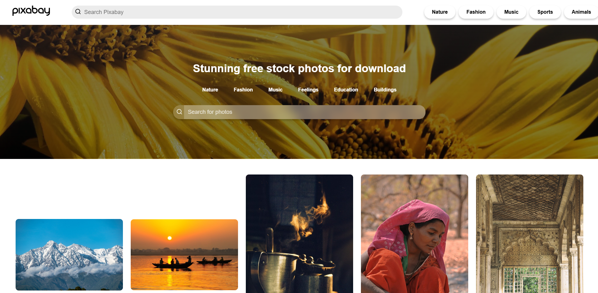

# 🖼️ PixabaySearcher📸

PixabaySearcher is a React-based app that allows users to search for images from the **Pixabay** platform 🌍. The app lets users explore images in various categories such as **Nature**, **Fashion**, **Music**, etc. This project mimics the Pixabay image search functionality with a simple and user-friendly interface 😎.

## 🎯 Features

- **Search by Category**: Search images by selecting categories like **Nature**, **Fashion**, **Music**, etc. 🎨
- **Pixabay API Integration**: Fetches images directly from the **Pixabay API** using categories 📡.
- **Default Image**: Displays a default image related to **India** if no category is selected 🇮🇳.
- **Responsive Design**: The app is optimized for all screen sizes 📱💻.
- **User-Friendly UI**: Includes a header with the app's name, a search bar, and category buttons for easy navigation 👨‍💻👩‍💻.

  
## 🖼️ Screenshots



## ⚙️ Getting Started

Follow these steps to get the project up and running locally:

### 🧰 Prerequisites

- [Node.js](https://nodejs.org/) (Install if you don't have it)
- [ReactJS](https://reactjs.org/) (Can be installed using `npx create-react-app`)
- An **API key** from [Pixabay](https://pixabay.com/api/docs/) (Sign up to get your key)

### 🚀 Installation

1. Clone the repository:
   ```bash
   git clone https://github.com/PRATIKSINDHIYA/PixabayImageSearch.git
   ```

2. Navigate to the project folder:
   ```bash
   cd PixabayImageSearch
   ```

3. Install required dependencies:
   ```bash
   npm install
   ```

4. Set up your **Pixabay API key**:
   - Create a `.env` file in the root of your project and add your API key:
     ```text
     REACT_APP_PIXABAY_API_KEY= 48187514-953107941c7a53e55110e24cd
     ```

5. Start the project:
   ```bash
   npm start
   ```

Your app should now be running locally 🌐!

## 🖥️ Usage

1. Open the app in your browser 🌍.
2. You'll see a header with the app's name and a search bar.
3. Below the search bar, there are category buttons like:
   - 🌿 **Nature**
   - 👗 **Fashion**
   - 🎶 **Music**
   - 💖 **Feelings**
   - 🎓 **Education**
   - 🏢 **Buildings**
4. Click any button to fetch images related to the selected category.
5. If no category is selected, a **default image of India** will be shown 🇮🇳.

## 🤝 Contributing

Want to contribute? Great! Follow these steps:

1. Fork the project 🍴
2. Create your feature branch (`git checkout -b feature-name`) 🌱
3. Commit your changes (`git commit -am 'Add new feature'`) 📝
4. Push to the branch (`git push origin feature-name`) 🚀
5. Open a pull request to the main repository 📨

## 🙏 Acknowledgements

- Thanks to the [Pixabay API](https://pixabay.com/api/docs/) for providing access to free-to-use images 🌟.

## 📬 Contact

- **Email**: [pratiksindhiya3@gmail.com](mailto:pratiksindhiya3@gmail.com)
- **LinkedIn**: [https://www.linkedin.com/in/pratiksindhiya/](https://www.linkedin.com/in/pratiksindhiya/)
```
